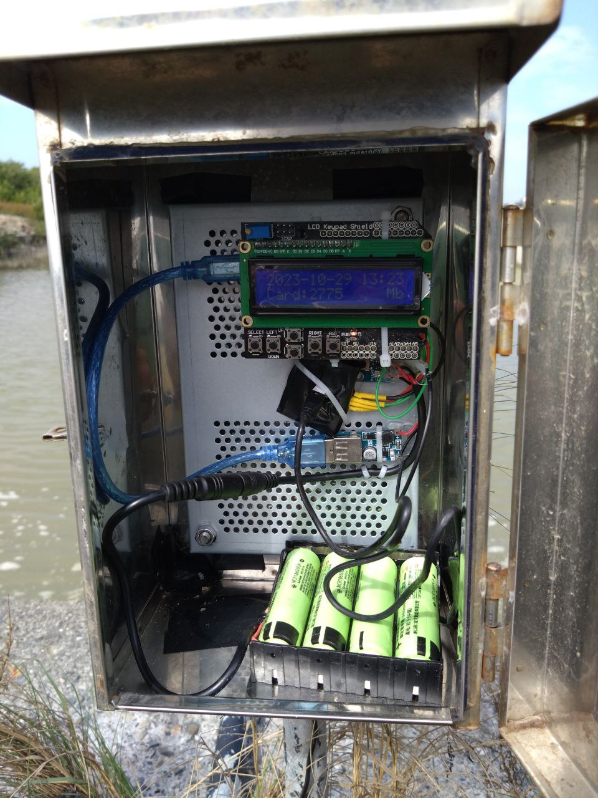
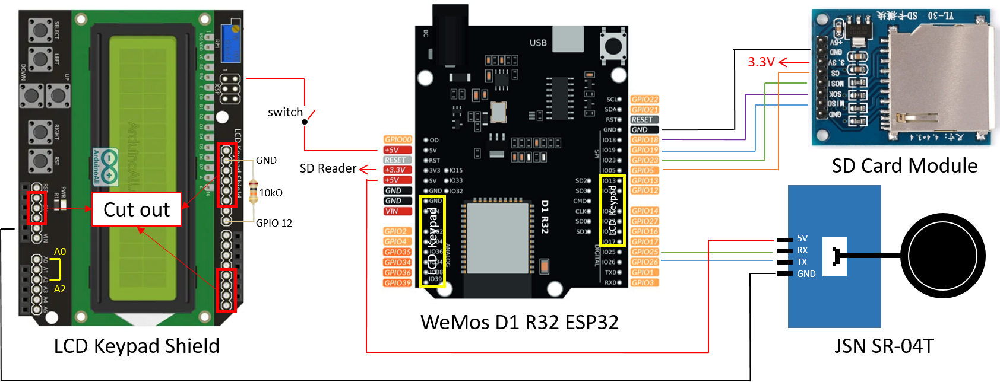

# 自動水位計 Water Level Meter
- 定時起動測距並存入SD卡後關閉電源

## 硬體 Hardwares
- [Arduino UNO R3](https://docs.arduino.cc/hardware/uno-rev3): [NT$760](https://www.taiwansensor.com.tw/product/arduino-uno-r3-%E7%BE%A9%E5%A4%A7%E5%88%A9%E5%8E%9F%E8%A3%9D-arduino-uno-rev33-%E9%96%8B%E7%99%BC%E6%9D%BF-made-in-italy/)
- Data Logging shield: [NT$95](https://www.taiwansensor.com.tw/product/arduino-data-logging-shield-%E6%95%B8%E6%93%9A%E8%B3%87%E6%96%99%E7%B4%80%E9%8C%84%E6%93%B4%E5%85%85%E6%9D%BF-%E5%85%A7%E5%BB%BA%E6%99%82%E9%90%98%E6%A8%A1%E7%B5%84/)
- LCD Keypad Shield: [NT$143](https://www.taiwaniot.com.tw/product/arduino-lcd-keypad-shield-lcd1602-%E6%B6%B2%E6%99%B6%E6%8C%89%E9%8D%B5%E6%93%B4%E5%B1%95%E6%9D%BF/)
- JSN-SR04T: 一體化超音波測距模組 [NT$ 230](https://www.jmaker.com.tw/products/jsn-sr04t)
- Adafruit TPL5110 Low Power Timer: [NT$ 177](https://www.digikey.tw/zh/products/detail/adafruit-industries-llc/3435/6817229?utm_adgroup=General&utm_source=google&utm_medium=cpc&utm_campaign=PMax%20Shopping_Product_High%20ROAS&utm_term=&productid=6817229&utm_content=General&utm_id=go_cmp-17816677620_adg-_ad-__dev-c_ext-_prd-6817229_sig-Cj0KCQiA4Y-sBhC6ARIsAGXF1g7mh5dq-jS-meWzVdt6N0Bxc7rBbIxxHn7A2hlxktgEKeGiNdYmplUaAk5OEALw_wcB&gad_source=1&gclid=Cj0KCQiA4Y-sBhC6ARIsAGXF1g7mh5dq-jS-meWzVdt6N0Bxc7rBbIxxHn7A2hlxktgEKeGiNdYmplUaAk5OEALw_wcB)
- USB 5V升壓模組: [NT$48](https://www.taiwaniot.com.tw/product/dc-dc%E5%8D%87%E5%A3%93%E6%A8%A1%E7%B5%840-95v%E5%8D%875v-600ma-usb%E5%8D%87%E5%A3%93%E9%9B%BB%E8%B7%AF%E6%9D%BF-%E8%A1%8C%E5%8B%95%E9%9B%BB%E6%BA%90/)
- 18650 3.7V 外接電源
- 蕭特基二極體
- TPL5110電阻: 依定時間隔選購
- 
|Timer | Resistance |
|-------- | -------- |
|100 ms | 500 Ω|
|200 ms | 1000 Ω|
|300 ms | 1500 Ω|
|400 ms | 2000 Ω|
|500 ms | 2500 Ω|
|600 ms | 3000 Ω|
|700 ms | 3500 Ω|
|800 ms | 4000 Ω|
|900 ms | 4500 Ω|
|1 s | 5.20 kΩ|
|2 s | 6.79 kΩ|
|7 s | 9.71 k Ω|
|8 s | 10.18 kΩ|
|9 s | 10.68 kΩ|
|30 s | 16.78 kΩ|
|50 s | 20.047 kΩ|
|2 min | 29.35 kΩ|
|3 min | 34.73 kΩ|
|4 min | 39.11 kΩ|
|5 min | 42.90 kΩ|
|6 min | 46.29 kΩ|
|7 min | 49.38 kΩ|
|9 min | 54.92 kΩ|
|10 min | 57.44 kΩ|
|20 min | 77.57 kΩ|
|30 min | 92.43 kΩ|
|40 min | 104.67 kΩ|
|50 min | 115.33 kΩ|
|1 hr | 124.91 kΩ|
|1 hr 30 min | 149.39 kΩ|

## 接線Wiring

### Data Logging shield - JSN SR-04T
 1. A1接TPL5110的Done
 2. D3接JSN SR-04T的RX
 3. D2接JSN SR-04T的TX
 4. 5V接JSN SR-04T的5V

### TPL5110
1. VDD接外接電源+
2. Delay和GND間用電阻接起來, 電阻值和間隔時間有關, 參考上面的表, 但不太準, 要自己試
3. DRV通過蕭特基二極體接USB模組+
4. Done接Data Logging shield A1

### USB模組
1. +通過蕭特基二極體接TPL5110 DRV

## Code

### Code 1: [waterlevel_code1.ino](waterlevel_code1.ino)
 - 用LCD Keypad Shield調整 Adjust RTC with buttons of the LCD Keypad Shield
  * SELECT: 選擇要調整的單位(年月日時分秒) Options change between year, month, day, hour, minute, second, schedule (every * minutes)
  * LEFT: 顯示現在時間 Show datetime now
  * UP: 增加值 Increase the number of select options
  * DOWN: 減少值 Decrease the number of select options
